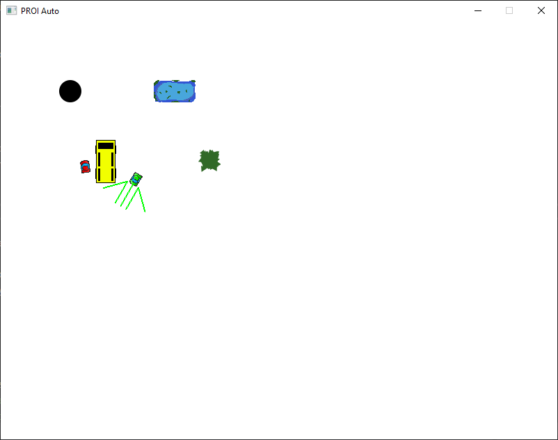
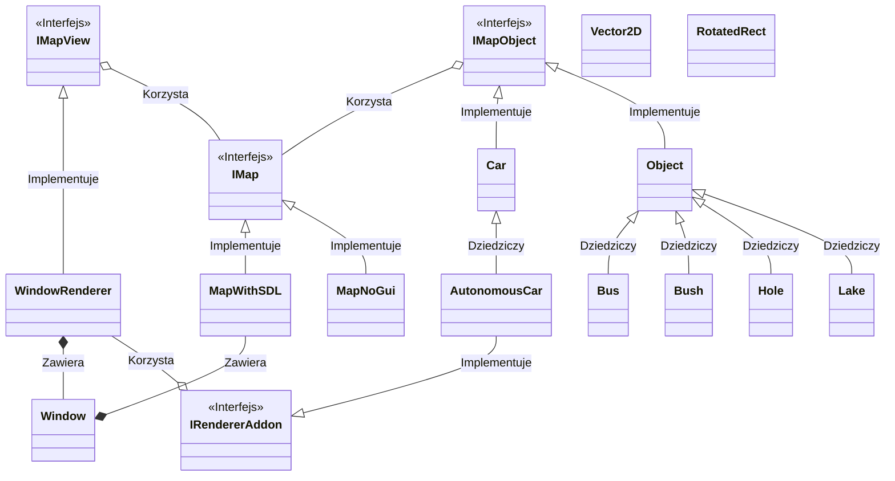

# 203.1 Pojazd Autonomiczny

Skład zespołu: Mateusz Brzozowski, Mikołaj Kuranowski, Jan Rusak

# Budowanie projektu

Projekt korzysta z systemu CMake.

Problem występuje jednak z zarządzaniem zewnętrznymi bibliotekami - obecnie CMakeLists.txt
zawiera różne ścieżki rozwiązywania zależności: na Windowsie za pomocą `vcpkg` i `pkg-config`
na pozostałych platformach.

Lista wymaganych pakietów

### Windows (vcpkg)
`vcpkg install gtest:x64-windows sdl2:x64-windows`

### Debian/Ubuntu
`sudo apt install pkg-config googletest libsdl2-dev`

### Arch/Manjaro
`sudo pacman -Syu gtest sdl2`

# Wygląd programu

# Struktura klas

Podział odpowiedzialności:
1. Mikołaj Kuranowski
    - Interfejs IMap
    - Interfejs IMapView
    - Interfejs IMapObject
    - Klasa MapNoGui
    - Klasa MapWithSDL
    - Klasa Window
    - Klasa WindowRenderer
    - CMakeLists
2. Mateusz Brzozowski
    - Klasa Car
    - Klasa AutonomousCar
3. Jan Rusak
    - Klasa Object
    - Klasa Bus
    - Klasa Bush
    - Klasa Hole
    - Klasa Lake
    - Testy

Opisy klas znajdują się w headerach i są kompatybilne z generatorem dokumentacji
`doxygen`. Dołączono również przykładowy plik `.doxygen-config`.
